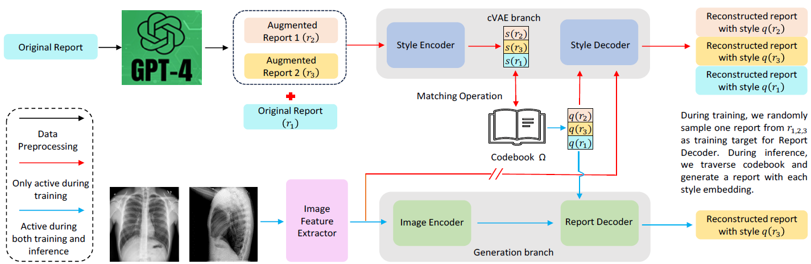

# 🩻 X-Gen: Enhancing Radiology Report Generation via LLM-Driven Data Augmentation and Decoupled Training

[](https://dicta2025.org/)
[](#)
[](https://www.python.org/)
[](https://pytorch.org/)
[](LICENSE)

Official PyTorch implementation of the **DICTA 2025 Oral Presentation**:  
**"X-Gen: Enhancing Radiology Report Generation via LLM-Driven Data Augmentation and Decoupled Training"**

> **Note:** This repository currently focuses on the implementation of the **IU X-ray** dataset using **R2Gen** as the baseline report generation branch.

---

## 📌 Abstract

The scarcity and limited accessibility of medical data significantly challenge deep learning applications in medical AI. Radiology report generation (RRG), a key medical AI research area, could greatly improve computer-aided diagnosis through automated X-ray image interpretation. However, obtaining paired X-ray images and reports is labor-intensive and restricted by strict regulations. 

Large language models (LLMs), such as GPT-4, provide a promising alternative by enabling cost-effective text data augmentation and report rewriting in varied styles. We rigorously assess augmented data's clinical accuracy and stylistic similarity to radiologist-authored reports through expert evaluations. Interestingly, augmented data enhances RRG model performance, yet performance declines when augmented data surpasses original data volume due to **style distribution shifts**. 

To mitigate this, we propose integrating a **conditional variational autoencoder (cVAE)** into the RRG model to separate medical semantics from writing styles during training, enabling better handling of augmented data's distribution shift. Our proposed method, **X-Gen**, combines data augmentation with decoupled training. Tested on two public Chest X-ray datasets and a private abdomen X-ray dataset, X-Gen significantly improves the performance of baseline models, showcasing its effectiveness and versatility in X-ray report generation.

---

## 📐 Architecture & Data Flow

Below is the overarching dataflow and decoupling pipeline of the **X-Gen** framework:

<p align="center">
  
</p>

---

## 🚀 Quick Start

### 1. Environment Setup

Clone the repository and create a conda environment:

```bash
git clone [https://github.com/your-username/X-Gen.git](https://github.com/your-username/X-Gen.git)
cd X-Gen

# Create and activate environment
conda create -n xgen python=3.8 -y
conda activate xgen

# Install dependencies
pip install -r requirements.txt
```

---

## 📊 Data Preparation

### Step 1: Download Official IU X-Ray Images
1. Download the official image dataset directly from the [NIH IU X-Ray Dataset Repository](https://openi.nlm.nih.gov/).
2. Extract all images and place them inside the `data/iu_xray/images/` directory:

```text
X-Gen/
└── data/
    └── iu_xray/
        └── images/
            ├── CXR1_1_IM-0001-1001.png
            ├── CXR1_1_IM-0001-2001.png
            └── ...
```

### Step 2: LLM-Driven Report Augmentation
To generate augmented report variants using OpenAI's API (GPT-4/GPT-3.5), run the provided augmentation script:

```bash
python augment_llm.py \
    --openai_api_key "YOUR_OPENAI_API_KEY" \
    --input_json data/iu_xray/annotation.json \
    --output_json data/final_aug_4.json \
    --aug_factor 4
```

### Step 3: Prepared Final Dataset
For quick reproduction, we provide our final augmented dataset directly in the repository:
* **`data/final_aug_4.json`**: Contains paired clinical report annotations along with $4\times$ LLM-augmented stylistic variants utilized in our experiments.

---

## 🏋️ Training & Evaluation

To train the **R2Gen + cVAE Decoupled Training** architecture on the IU X-ray dataset:

```bash
# Train the X-Gen model with decoupled training
python main.py \
    --image_dir data/iu_xray/images \
    --annotation data/final_aug_4.json \
    --dataset iu_xray \
    --model_name r2gen_cvae \
    --epochs 100 \
    --batch_size 16 \
    --lr 1e-4
```

To evaluate a pre-trained checkpoint on the test set:

```bash
python test.py \
    --image_dir data/iu_xray/images \
    --annotation data/final_aug_4.json \
    --load checkpoints/xgen_iu_xray_best.pth
```

---

## 📝 Citation

If you find **X-Gen** useful for your research or applications, please cite our paper:

```bibtex
@inproceedings{xgen2025dicta,
  title     = {X-Gen: Enhancing Radiology Report Generation via LLM-Driven Data Augmentation and Decoupled Training},
  author    = {Your Name and Co-authors},
  booktitle = {Digital Image Computing: Techniques and Applications (DICTA)},
  year      = {2025},
  note      = {Oral Presentation}
}
```

---

## 🙏 Acknowledgements

This repository builds upon and adapts components from [R2Gen](https://github.com/cqy2019/R2Gen). We express our gratitude to the authors for open-sourcing their work.